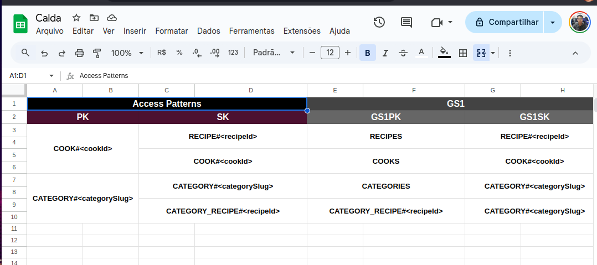

# Calda API


# 🇧🇷 🇺🇸 Calda - Receitas

**Calda** é um projeto inspirado no **CREME**, um dos sites de receitas com o design mais bem construído que já conheci. O principal objetivo deste projeto foi aprimorar meus conhecimentos em **Serverless Framework (AWS)** e **DynamoDB**, com um destaque especial para o desafio de modelagem de dados utilizando o padrão **Single Table Design**.

---

## **Rotas da aplicação**

### **Cozinheiros**

- **Listar todos os cozinheiros:** Retorna uma lista com todos os cozinheiros cadastrados.
- **Buscar um cozinheiro específico:** Retorna os dados de um cozinheiro com base no identificador fornecido.
- **Registrar um novo cozinheiro:** Permite cadastrar novos cozinheiros na aplicação.

### **Receitas**

- **Buscar receitas por categoria:** Filtra receitas com base em uma categoria específica.
- **Buscar receitas pela chave (PK + SK):** Retorna receitas específicas utilizando a chave primária e a chave de classificação.
- **Buscar receitas pelo cozinheiro:** Lista todas as receitas associadas a um cozinheiro específico.
- **Buscar todas as receitas:** Retorna todas as receitas cadastradas na aplicação.
- **Registrar uma receita:** Permite cadastrar novas receitas, associando-as a categorias e cozinheiros.

### **Categorias**

- **Criar uma categoria:** Permite cadastrar novas categorias para organizar as receitas.
- **Buscar todas as categorias:** Retorna uma lista com todas as categorias disponíveis.

> Nota: Para facilitar o teste das rotas, um template para o Yaak/Insomnia está disponível na pasta resources.

---

## Modelagem

A modelagem do banco de dados foi realizada com base em uma planilha onde, inicialmente, foram definidos os **Access Patterns** (padrões de acesso). Com base nisso, foi criado o **Entity Chart**, que contém os atributos, chaves primárias e **GSIs** (Global Secondary Indexes) necessários para atender aos requisitos do sistema.



> A planilha de modelagem também está disponível na pasta **resources**.

---

## Como executar o projeto

Para executar o projeto localmente, utilize o comando:

```bash
serverless dev
```

Este comando inicia um emulador local do **AWS Lambda** e cria um túnel para enviar e receber requisições do Lambda. Dessa forma, você pode interagir com as funções como se estivessem rodando na nuvem.

Assim, é possível desenvolver e testar o sistema localmente, visualizando os resultados em tempo real, sem a necessidade de reimplantar o projeto.

---

## **🇺🇸 English Version - Calda Recipes**

**Calda** is a project inspired by **CREME**, one of the best-designed recipe websites I have ever seen. The main goal of this project was to enhance my skills in **Serverless Framework (AWS)** and **DynamoDB**, with a particular focus on the challenge of data modeling using the **Single Table Design** pattern.

---

## **Application Routes**

### **Chefs**

- **List all chefs:** Retrieves a list of all registered chefs.
- **Get a specific chef:** Fetches the details of a chef by their unique identifier.
- **Register a new chef:** Allows you to add new chefs to the application.

### **Recipes**

- **Get recipes by category:** Filters recipes based on a specific category.
- **Get recipes by key (PK + SK):** Fetches a specific recipe using the primary and sort keys.
- **Get recipes by chef:** Lists all recipes associated with a specific chef.
- **List all recipes:** Retrieves all recipes registered in the application.
- **Register a new recipe:** Allows you to add new recipes, linking them to categories and chefs.

### **Categories**

- **Create a category:** Allows you to create new categories for organizing recipes.
- **List all categories:** Retrieves a list of all available categories.

> Note: To make testing easier, a template for Yaak/Insomnia is available in the resources folder.

---

## **Data Modeling**

The database modeling was designed using a spreadsheet. Initially, **Access Patterns** were defined to determine the query needs. Based on this, an **Entity Chart** was created, containing the attributes, primary keys, and **GSIs** (Global Secondary Indexes) required to meet the system requirements.


> The modeling spreadsheet can also be found in the **resources** folder.

---

## **How to Run the Project**

To run the project locally, use the following command:

```bash
serverless dev
```

This command starts a local emulator of **AWS Lambda** and creates a tunnel to send and receive requests to and from the Lambda. This setup allows you to interact with your functions as if they were running in the cloud.

It enables local development and testing, letting you see results in real time without needing to redeploy the project.

---

🫡 By Marcos Henrique
